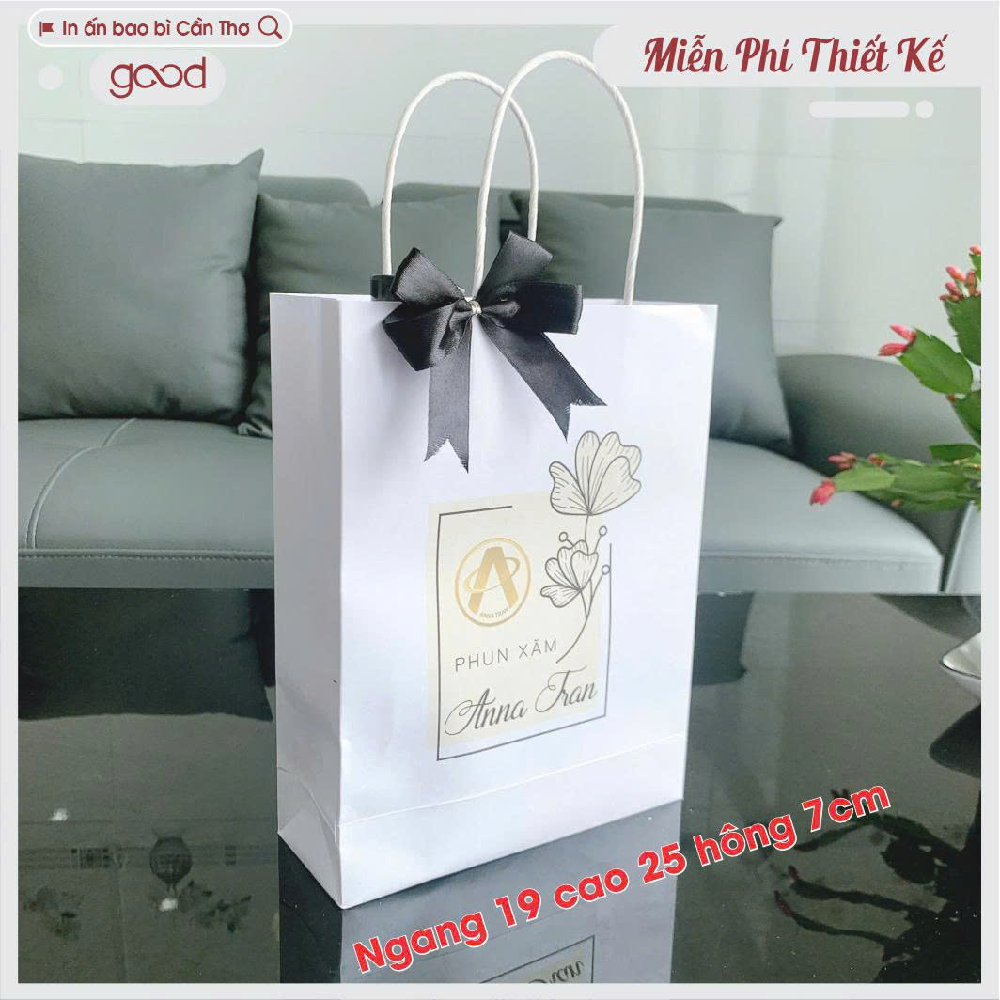
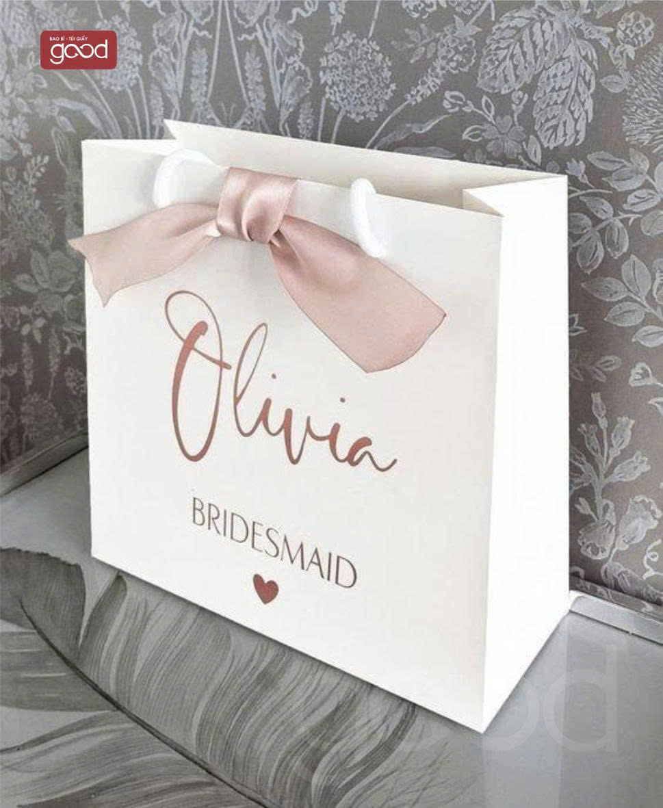
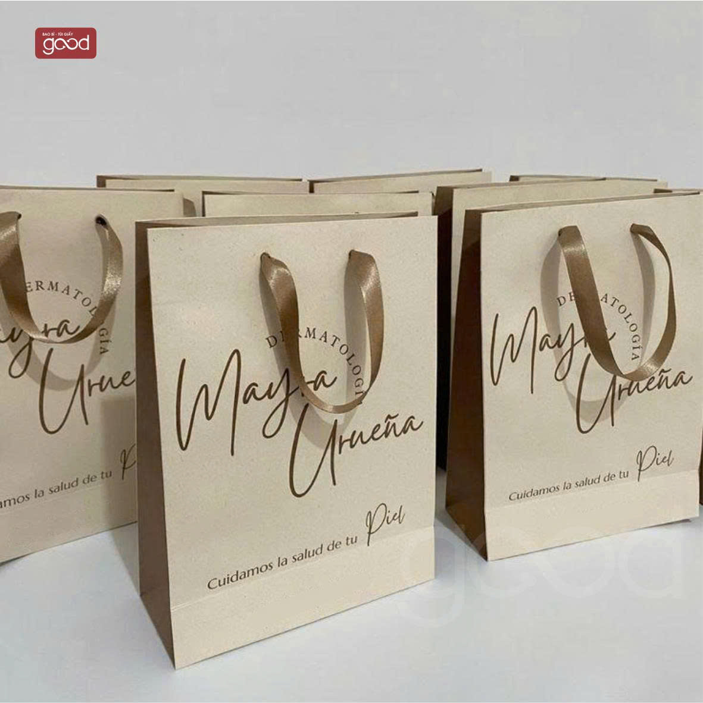
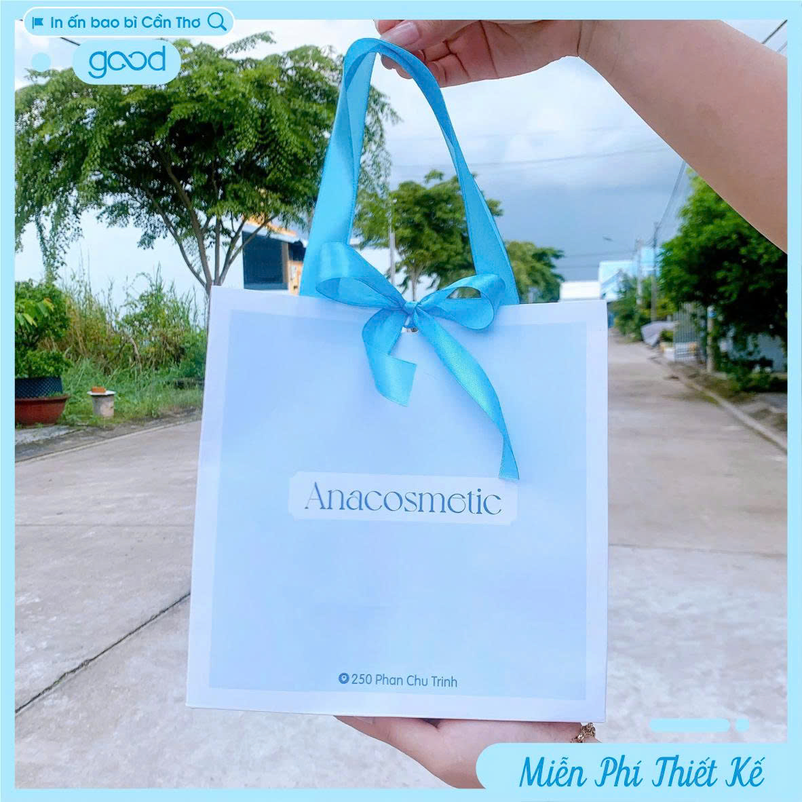
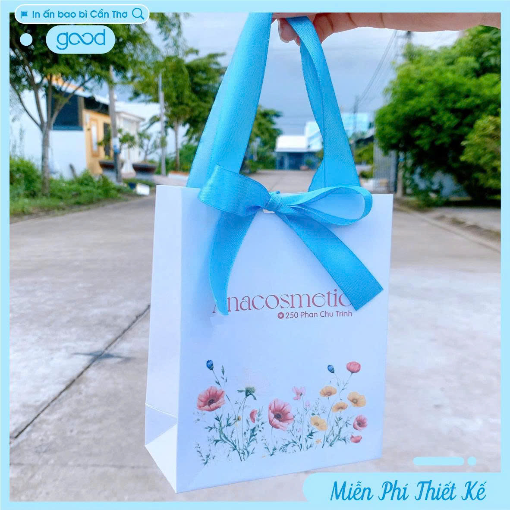
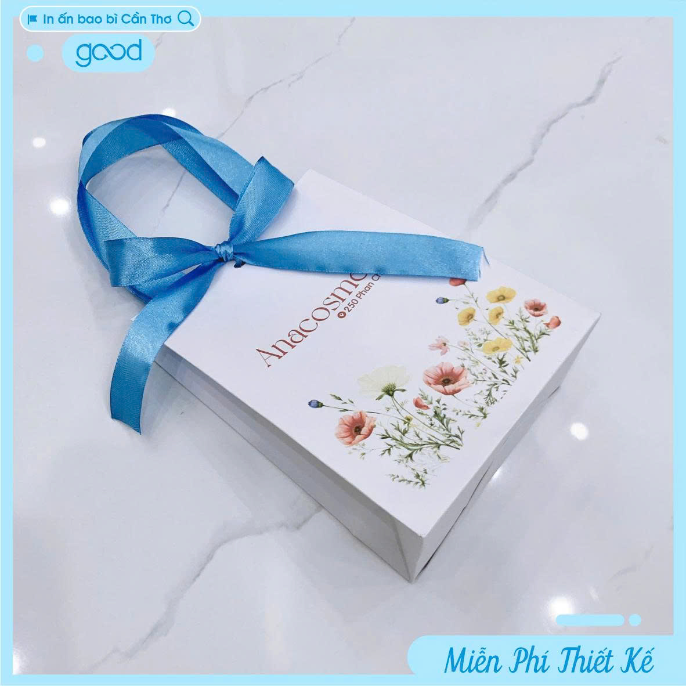
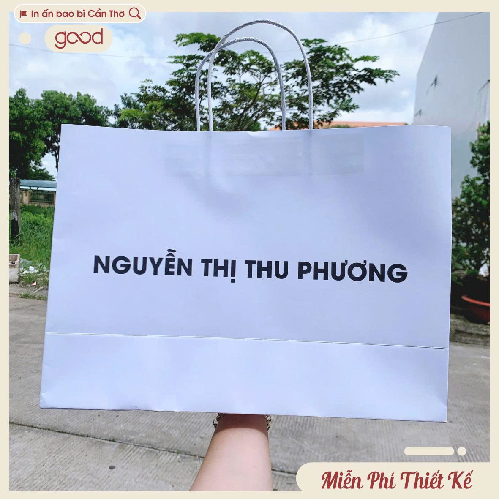

# Túi Giấy Kraft – Giải Pháp Bao Bì Xanh, Tinh Tế & Đẳng Cấp

Túi giấy kraft không chỉ là một sản phẩm bao bì thông thường mà còn là “bộ mặt thương hiệu” thể hiện gu thẩm mỹ, giá trị và trách nhiệm môi trường của doanh nghiệp. Với vẻ đẹp mộc mạc nhưng hiện đại, túi kraft đang trở thành xu hướng được ưa chuộng trong nhiều lĩnh vực như thời trang, mỹ phẩm, thực phẩm và quà tặng cao cấp.

---

## Vì Sao Túi Giấy Kraft Được Ưa Chuộng?

### 🌿 Vẻ Đẹp Tự Nhiên & Gần Gũi

Màu nâu đặc trưng của giấy kraft mang lại cảm giác ấm áp, thân thiện và tối giản – rất phù hợp với phong cách thiết kế hiện đại, eco-friendly.

### 💪 Độ Bền Vượt Trội

Giấy kraft có kết cấu sợi dài, giúp:

- Chịu lực tốt
    
- Khó rách hơn giấy thông thường
    
- Bảo vệ sản phẩm an toàn khi vận chuyển
    

### ♻️ Thân Thiện Môi Trường

- Có thể tái chế 100%
    
- Phân hủy sinh học nhanh chóng
    
- Giảm thiểu rác thải nhựa
    

---

## Ứng Dụng Thực Tế

### 🛍️ Ngành Thời Trang

- Túi đựng quần áo, phụ kiện
    
- Tăng tính cao cấp cho sản phẩm
    

### 🍰 Ngành Thực Phẩm

- Túi bánh mì, cà phê, đồ ăn mang đi
    
- An toàn, không độc hại
    

### 🎁 Quà Tặng & Sự Kiện

- Túi quà tặng sang trọng
    
- Phù hợp hội nghị, event
    

---

## Tùy Chọn Thiết Kế & In Ấn

### 🎨 Đa Dạng Phong Cách

- In logo đơn sắc hoặc nhiều màu
    
- Thiết kế tối giản hoặc sáng tạo
    
- Phù hợp nhận diện thương hiệu
    

### 🖨️ Công Nghệ In Hiện Đại

- In offset sắc nét
    
- In lụa tiết kiệm chi phí
    
- Ép kim sang trọng
    
- Dập nổi / dập chìm độc đáo
    

---

## Cấu Tạo & Thông Số Kỹ Thuật

### 📦 Chất Liệu

- Giấy kraft nâu / trắng
    
- Định lượng: 120gsm – 300gsm
    

### 🧵 Quai Túi

- Quai giấy xoắn
    
- Quai dây dù / dây cotton
    
- Quai dẹt chắc chắn
    

### 📏 Kích Thước

- Tùy chỉnh theo yêu cầu
    
- Phù hợp từng loại sản phẩm
    

---

## Ưu Điểm Nổi Bật

✔️ Bền chắc – chịu lực tốt  
✔️ Thẩm mỹ cao – dễ nhận diện thương hiệu  
✔️ Thân thiện môi trường  
✔️ Giá thành hợp lý  
✔️ Dễ dàng tùy chỉnh thiết kế

---

## Cam Kết Chất Lượng

Chúng tôi cung cấp túi giấy kraft với tiêu chuẩn cao về chất lượng in ấn và gia công:

- Màu in sắc nét, không lem
    
- Đường gấp, dán chắc chắn
    
- Kiểm tra kỹ lưỡng trước khi giao hàng
    

---

## Lựa Chọn Túi Giấy Kraft – Lựa Chọn Tương Lai Xanh

Trong bối cảnh người tiêu dùng ngày càng quan tâm đến môi trường, việc sử dụng túi giấy kraft không chỉ giúp doanh nghiệp nâng cao hình ảnh chuyên nghiệp mà còn thể hiện trách nhiệm xã hội một cách rõ ràng.

👉 Hãy để túi giấy kraft trở thành cầu nối giữa thương hiệu của bạn và khách hàng – một cách tinh tế, bền vững và đầy ấn tượng.